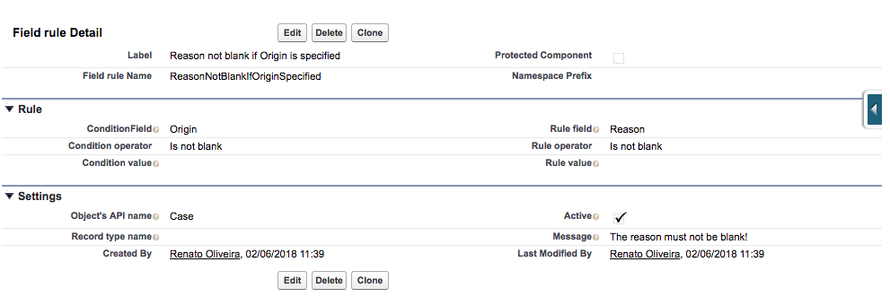

# Field Dependency Analyzer

This tool serves the purpose of relieving the administrator from the restrictive 100 rules per object limitation that the Salesforce platform imposes.

The idea is that this can replace simple validation rules, like when a field is changed or when a field depends on another one.

# Motivation

I had a task in which I had to create some (many) validation rules for a single object. This wouldn't be a problem under normal circumstances, but the object had more than 10 record types, and each of them had 20+ rules in total. The limit of 100 validation rules would easily be reached.

## Usage

For example, if you want to that a specific field to be mandatory when another field is of certain value, you would write a rule to check if the first field has the value, and then check the second one. I'd call those as "condition to fire" (condition) and "condition to check" (rule).

"If the Origin is specified on the case, then the Reason has to be specified as well." would be translated to a validation rule like this:

    NOT(ISBLANK(Origin)) && ISBLANK(Reason)

This is so small, so simple, that in our case it doesn't make sense to waste a precious resource (a validation rule "slot"). With this tool, this same rule could be written with our custom metadata, like this:

This rule can be read in a similar way as our validation rule: "when field Origin is not blank, field Reason should not be blank either".

By using `addError` on a trigger context, we are able to deliver a friendly error message to our users:

And this without "spending" a validation rule.

## Limitations and concerns

This tool is pretty limited for now. It is missing the logic for the operators that compare data (greater than, lesser than, etc).

Also, we can brag of not "wasting" validation rules, but we can not add the error message to the specific field, just on the top of the record page. And most importantly: we are leaving the validation to the part where Apex is executed. For comparison effect, the standard validation rules are executed before the record is handled by Apex.

Essentially, we are now "wasting" Apex run time with this. So please take this into consideration when handling many rules and many records at once. If you are already close to the run time limit, consider optimizing your triggers first, since this tool can take some more of your run time (depending, of course, of how many rules you are using).

## Installation

You can install this tool by using the following link:

https://login.salesforce.com/packaging/installPackage.apexp?p0=04t1I0000036qzR

...or by using the metadata API to upload the resources on the `src` folder to your org manually.